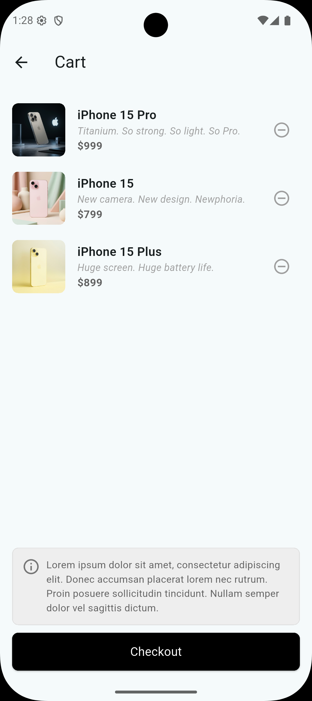

# E-Commerce App

Flutter ile geliştirilmiş bir e-ticaret/katalog uygulaması. Ürünleri keşfetme, ürün detaylarını görüntüleme ve sepete ekleme akışlarını kapsayan; widget mimarisi, sayfa geçişleri (Navigator) ve REST API entegrasyonu üzerine kurulu bir mobil uygulama projesidir.

## Önizleme

| Ana Sayfa                                 | Ürün Detayı                                    | Sepet                                 |
| ----------------------------------------- | ---------------------------------------------- | ------------------------------------- |
|  |  |  |

Ana sayfada ürünler `GridView` ile kart tabanlı olarak listelenir. Ürün detayı ekranında Hero animasyonu, açıklama ve "Buy Now" butonu bulunur; bu buton ürünü sepete ekler. Sepet ekranında eklenen ürünler listelenir ve checkout butonu gösterilir.

## Özellikler

- **Ürün Keşfi** — API'den çekilen ürünlerin `GridView` ile kart tabanlı listelenmesi
- **Sepet Yönetimi** — `Set<int>` tabanlı state güncellemesiyle ürün ekleme/çıkarma
- **Sayfa Navigasyonu** — `Navigator.push` ile ana sayfa → detay → sepet akışı
- **Hero Animasyonu** — Ürün kartından detay sayfasına geçişte akıcı görsel animasyon
- **REST API Entegrasyonu** — `http` paketi ile uzak sunucudan ürün verisi çekme
- **Model Tabanlı Veri Yönetimi** — `fromJson` / `toJson` ile tip güvenli veri modelleri
- **Bileşen Tabanlı Mimari** — `ProductItemTile`, `CartItemTile` gibi yeniden kullanılabilir widget'lar
- **Kullanıcı Geri Bildirimi** — Ürün sepete eklendiğinde `SnackBar` ile bilgilendirme

## Kullanılan Teknolojiler

| Teknoloji             | Açıklama                                                |
| --------------------- | ------------------------------------------------------- |
| **Flutter**           | Dart SDK `^3.12.2` ile çapraz platform mobil geliştirme |
| **Dart**              | Uygulama mantığı ve veri modelleme                      |
| **http**              | `^1.6.0` — REST API istekleri için                      |
| **Material Design 3** | `useMaterial3: true` ile modern arayüz bileşenleri      |
| **cupertino_icons**   | `^1.0.8` — iOS stil ikonlar                             |

## Proje Yapısı

```
lib/
├── main.dart                       # Uygulama giriş noktası
├── models/
│   └── product_models.dart         # ProductModel, Meta, Data sınıfları (fromJson/toJson)
├── services/
│   └── api_service.dart            # API isteklerini yöneten servis sınıfı
├── components/
│   ├── product_item_tile.dart      # Grid'de gösterilen ürün kartı
│   └── cart_item_tile.dart         # Sepet ekranındaki ürün satırı
└── views/
    ├── home_screens.dart           # Ana sayfa (Discover) ve ürün listesi
    ├── product_detail_screen.dart  # Ürün detay ekranı
    └── cart_screen.dart            # Sepet ekranı
```

## Ekran Akışı

```
HomeScreen (Discover)
   ├──► ProductDetailScreen   (ürün kartına tıklanınca, Route Arguments ile)
   │        └──► "Buy Now"  → ürünü sepete ekler (state güncelleme)
   └──► CartScreen            (sepet ikonuna tıklanınca)
            └──► Checkout / ürün kaldırma
```

## Kurulum ve Çalıştırma

### Gereksinimler

- [Flutter SDK](https://docs.flutter.dev/get-started/install) (Dart SDK `^3.12.2` uyumlu)
- Android Studio veya VS Code
- Bir Android Emulator / iOS Simulator ya da fiziksel cihaz

### Adımlar

1. Depoyu klonla:

   ```bash
   git clone https://github.com/aysenurpak/e-commerce-app.git
   cd e-commerce-app
   ```

2. Bağımlılıkları yükle:

   ```bash
   flutter pub get
   ```

3. Bağlı bir cihaz/emülatör olduğundan emin ol:

   ```bash
   flutter devices
   ```

4. Uygulamayı çalıştır:
   ```bash
   flutter run
   ```

## Bağımlılıklar

```yaml
dependencies:
  flutter:
    sdk: flutter
  cupertino_icons: ^1.0.8
  http: ^1.6.0

dev_dependencies:
  flutter_test:
    sdk: flutter
  flutter_lints: ^6.0.0
```

## Not

Bu projede kullanılan API uç noktaları (`wantapi.com`) demo amaçlıdır ve gerçek bir e-ticaret altyapısını temsil etmez.

## Geliştirici

\*\*Ayşenur Pak
